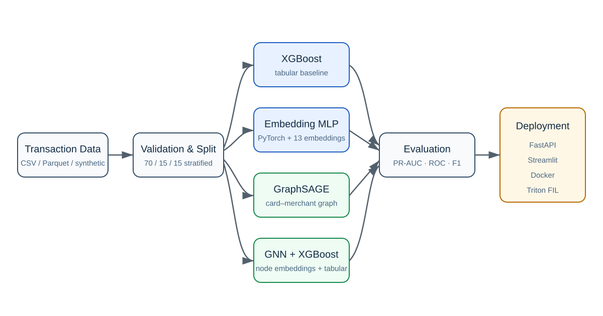
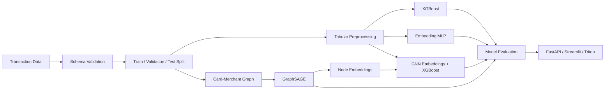
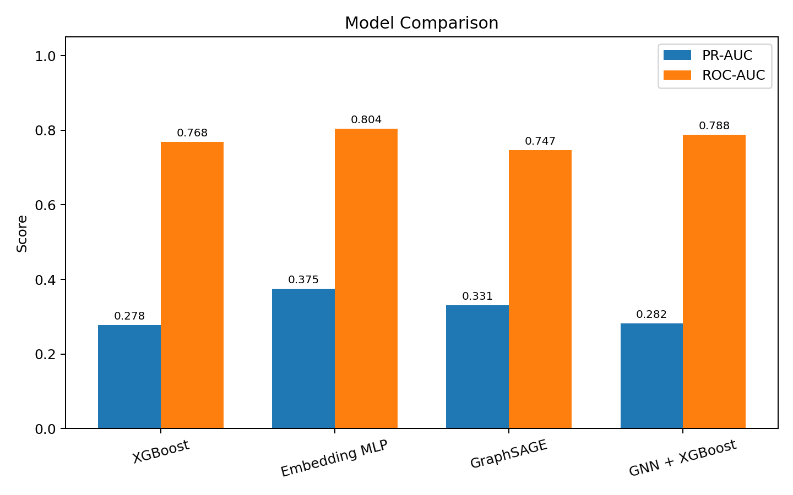
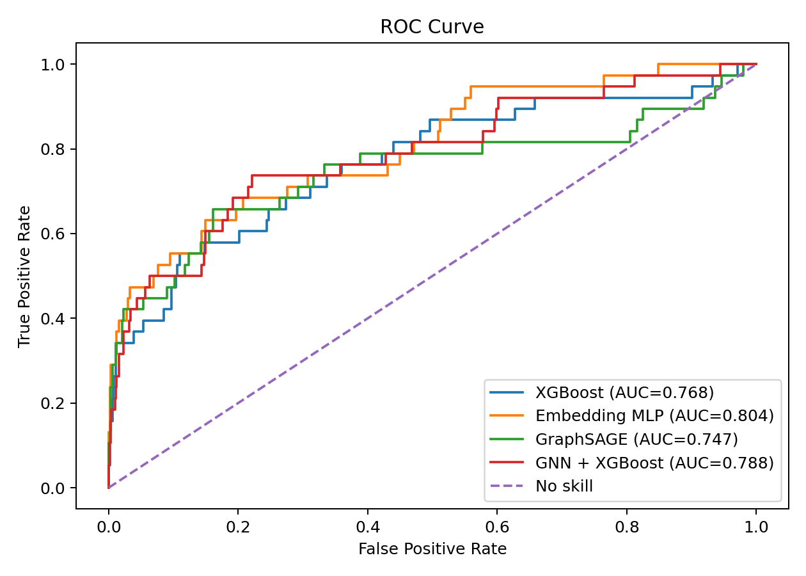
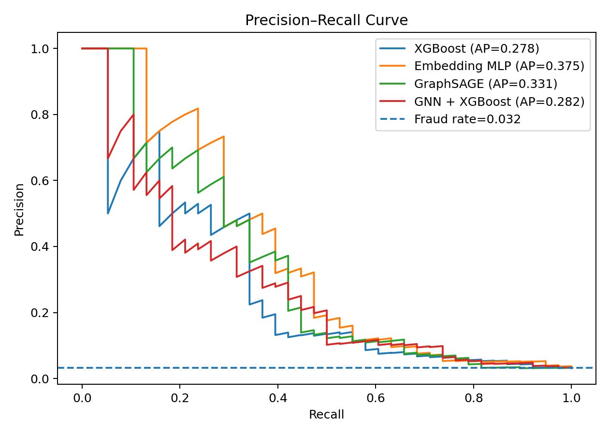

# Financial Fraud Detection using Deep Learning

[](#quick-start)
[](#models)
[](#deployment)
[](#deployment)
[](LICENSE)

An end-to-end FinTech portfolio project for detecting fraudulent financial transactions with XGBoost, a PyTorch embedding MLP, a card–merchant GraphSAGE model, and a hybrid GNN-embedding + XGBoost classifier.

The repository includes reproducible synthetic data, leakage-safe preprocessing, rare-event metrics, ROC and Precision–Recall curves, model comparison, FastAPI and Streamlit demos, Docker deployment, tests, CI, and an NVIDIA Triton FIL export template.

> Portfolio note: this is an original engineering rewrite inspired by concepts practised in an NVIDIA DLI anti-fraud course. The original course notebooks are not redistributed. The public code, documentation, synthetic data, app, tests, and deployment structure in this repository are newly implemented.

## Project Highlights
Based on the concepts learned from NVIDIA DLI,
I independently restructured the experiments into a modular Python pipeline, implemented a portable PyTorch GraphSAGE model, created a publishable synthetic benchmark, compared four model families, and developed API, dashboard and containerized deployment components.

- End-to-end pipeline from data generation to model serving
- **XGBoost baseline** with class weighting and PR-AUC evaluation
- **PyTorch MLP** with learned embeddings for 13 categorical features
- **GraphSAGE** fraud classification on a card–merchant bipartite graph
- **GNN node embeddings + XGBoost** downstream classifier
- Validation-selected fraud decision threshold
- FastAPI `/predict` endpoint and interactive Streamlit interface
- Docker Compose for API + dashboard
- NVIDIA Triton FIL model-repository export
- Unit tests and GitHub Actions CI

## Architecture





## Models

### 1. XGBoost baseline

A strong tree-based benchmark using ordinal-encoded categorical variables, numerical features, class weighting, and `aucpr` as the training metric.

### 2. PyTorch embedding MLP

Each categorical feature receives a trainable embedding. Embeddings are concatenated with standardized numerical features and passed through a regularized feed-forward network.

### 3. GraphSAGE fraud model

Transactions are represented as edges in a bipartite graph:

```text
Card node  ── transaction edge ──>  Merchant node
```

GraphSAGE propagates information over the training graph. An edge classifier scores each card–merchant transaction using source and destination embeddings plus numerical edge features.

### 4. GNN embeddings + XGBoost

Learned card and merchant representations are concatenated with tabular features and used by a downstream XGBoost classifier. This reproduces the common FinTech pattern of combining graph representation learning with a production-friendly tree model.

## Evaluation

Fraud detection is highly imbalanced, so **PR-AUC / Average Precision** is the primary metric. ROC-AUC, precision, recall, F1, and the confusion matrix are also reported. The decision threshold is selected on validation data by maximizing F1; the test set is used only for final evaluation.

### Reproducible synthetic benchmark

The included sample contains 8,000 synthetic transactions with a fraud rate of approximately 3.19%. These results are generated by `python scripts/train_all.py` and are not claimed to represent production performance.

| Model | ROC-AUC | PR-AUC | Precision | Recall | F1 |
|---|---:|---:|---:|---:|---:|
| XGBoost | 0.768 | 0.278 | 0.500 | 0.184 | 0.269 |
| Embedding MLP | 0.804 | 0.375 | 0.462 | 0.316 | 0.375 |
| GraphSAGE | 0.747 | 0.331 | 0.500 | 0.289 | 0.367 |
| GNN + XGBoost | 0.788 | 0.282 | 0.409 | 0.237 | 0.300 |



<p align="center">
  
  
</p>

## Repository Structure

```text
financial-fraud-detection-deep-learning/
├── src/fraud_detection/
│   ├── data.py                 # synthetic data, validation, splits
│   ├── preprocessing.py        # category encoding and scaling
│   ├── metrics.py              # PR-AUC, ROC-AUC, thresholding, plots
│   ├── inference.py            # production-style predictor wrapper
│   ├── pipeline.py             # end-to-end orchestration
│   └── models/
│       ├── xgboost_model.py
│       ├── mlp.py
│       ├── gnn.py
│       └── hybrid.py
├── scripts/
│   ├── generate_sample_data.py
│   ├── train_all.py
│   └── export_triton.py
├── api/main.py                 # FastAPI service
├── app/streamlit_app.py        # Streamlit demo
├── deployment/triton/          # Triton FIL repository
├── data/sample/                # publishable synthetic sample
├── artifacts/                  # trained demo model artifacts
├── reports/                    # metrics and visual outputs
├── notebooks/                  # clean end-to-end walkthrough
├── docs/                       # data card, model card, deployment guide
├── tests/
├── Dockerfile
├── docker-compose.yml
└── .github/workflows/ci.yml
```

## Quick Start

### 1. Create an environment

```bash
python -m venv .venv
source .venv/bin/activate        # Windows: .venv\Scripts\activate
pip install -r requirements-dev.txt
pip install -e .
```

### 2. Generate sample data

```bash
python scripts/generate_sample_data.py --rows 8000
```

### 3. Train all models and regenerate plots

```bash
python scripts/train_all.py
```

The command writes trained artifacts to `artifacts/models/`, test predictions to `artifacts/predictions/`, and evaluation outputs to `reports/`.

### 4. Run tests

```bash
pytest -q
```

## Deployment

### FastAPI

```bash
uvicorn api.main:app --reload
```

- Swagger UI: `http://localhost:8000/docs`
- Health check: `GET /health`
- Prediction: `POST /predict`

Example request:

```json
{
  "distance": 240.0,
  "age": 36,
  "amt": 950.0,
  "city_pop": 100000,
  "gender": "F",
  "job": "job_01",
  "category": "shopping_net",
  "city": "city_01",
  "state": "S01",
  "zip": "10001",
  "merchant": "merchant_001",
  "trans_hour": "2",
  "trans_minute": "30",
  "trans_second": "00",
  "trans_year": "2025",
  "trans_month": "7",
  "trans_day": "15"
}
```

### Streamlit

```bash
streamlit run app/streamlit_app.py
```

### Docker Compose

```bash
docker compose up --build
```

- API: `http://localhost:8000/docs`
- Dashboard: `http://localhost:8501`

### NVIDIA Triton FIL

```bash
python scripts/export_triton.py
```

This exports the XGBoost JSON model to `deployment/triton/model_repository/fraud_xgboost/`. Preprocessing remains an upstream responsibility: Triton receives the encoded `float32` feature matrix used during training.

See [deployment/triton/README.md](deployment/triton/README.md) for the container command and compatibility notes.

## Using a Real Dataset

Provide CSV or Parquet data containing the required columns listed in [docs/data_card.md](docs/data_card.md), then run:

```bash
python scripts/train_all.py --data path/to/your_dataset.parquet
```

Do not commit real card numbers, customer identifiers, authentication data, or regulated financial information to GitHub.

## Limitations and Responsible Use

This repository is a learning and portfolio artifact, not a production financial decision system. Before real deployment, add cost-sensitive thresholding, human review, model monitoring, drift detection, fairness assessment, explainability, privacy controls, authentication, audit logs, and institution-specific regulatory review.

## Resume Description

> Built an end-to-end financial fraud detection system comparing XGBoost, a PyTorch categorical-embedding MLP, GraphSAGE, and GNN-enhanced XGBoost; evaluated rare-event performance with PR-AUC/ROC-AUC, developed FastAPI and Streamlit inference interfaces, and packaged deployment with Docker and NVIDIA Triton FIL.

## License

MIT. See [LICENSE](LICENSE).

Fix README image paths
